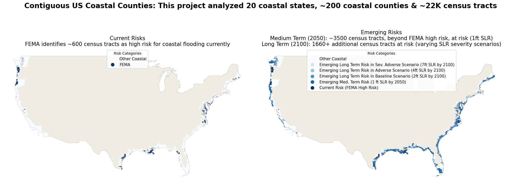
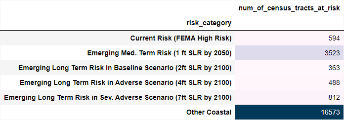

## References:
[1. US Coastal Counties Population](https://coast.noaa.gov/states/fast-facts/economics-and-demographics.html)

[2. NOAA](https://www.noaa.gov/)

[3. NOAA 2022 Sea Level Rise Technical Report](https://oceanservice.noaa.gov/hazards/sealevelrise/sealevelrise-tech-report-sections.html)

[4. Federal Reserve Board Stress Tests](https://www.federalreserve.gov/publications/2023-Stress-Test-Scenarios.htm)

[5. FEMA floodplains](https://www.fema.gov/flood-maps) 

[6. What is a census tract?](https://www.census.gov/programs-surveys/geography/about/glossary.html#par_textimage_13)
[7. Geospatial datafiles for contiguous US](https://www2.census.gov/geo/tiger/GENZ2022/shp/cb_2022_us_tract_5m.zip)

[8. Coastal Counties](https://www2.census.gov/library/stories/2018/08/coastline-counties-list.xlsx)

[9. FEMA National Risk Index (NRI)](https://hazards.fema.gov/nri/)

[10. SLR data](https://coast.noaa.gov/slrdata/)

# 
Impact of Rising Sea Levels on Coastal Residential Real Estate Assets

### Project Motivation and Goals

#### Why Coastal Real Estate and Why Sea Level Rise?

About 40% of the US population, or ~128 million people, reside in coastal counties [1](https://coast.noaa.gov/states/fast-facts/economics-and-demographics.html). While residential assets in general have been battered by a slew of extreme weather events in recent years, e.g., hurricanes, wildfires etc., for these coastal residents, another significant emerging risk is flooding and property loss due to accelerated sea level rise (SLR). However, in the exploratory research for this project, it was found that there may not yet be a deep understanding of the full extend of potential SLR impacts. Therefore, this project intends to bring awareness to regions expected to be impacted in the medium term (2050) and longer term (2100) in various scenarios of accelerated sea level rise. 

The National Oceanic and Atmospheric Administration (NOAA) is a leading US scientific agency charged with monitoring oceanic and atmospheric conditions[2](https://www.noaa.gov/). Per NOAA's 2022 Sea Level Rise Technical Report[3](https://oceanservice.noaa.gov/hazards/sealevelrise/sealevelrise-tech-report-sections.html), sea levels are currently rising at a <b><i>significantly accelerated pace</i></b> compared to previously observed levels in the 20th century: sea levels along the contiguous US coastline are expected to rise, on average, as much over the next 30 years (2020–2050) as they have over the last 100 years (1920–2020). 

Over the long term (by 2100), SLR projections along the contiguous US coastline vary between 2 - 7ft on average compared to 2000 levels. The variability in these projections is mainly due to uncertainity about future green house gas emission rates and resultant global warming, which is the key driver for SLR. Over the medium term (by 2050), given the warming of the ocean that has <i>already</i> occurred due to climate change[3](https://oceanservice.noaa.gov/hazards/sealevelrise/sealevelrise-tech-report-sections.html), contiguous US coastline sea levels are expected to rise between 1.3 - 2ft on average, <i>irrespective</i> of future emissions pathways or other climate mitigation action. Furthermore, these higher sea levels are also expected to cause more disruptive high tide flooding (HTF) events than occuring today: minor disruptive HTF events projected to increase from 3 events/year in 2020 to >10 events/year by 2050, and major destructive HTF events projected to increase from 0.04 events/year in 2020 to 0.2 events/year by 2050).

#### Project Goals

In light of these projections for coastal sea level rise for the contiguous US, the goals of this project are twofold: 
1. To give the general public (potential home buyers, mortgage lenders, et al.) a tool to visualize the regional impacts of SLR over the medium term (2050) and longer term (2100). Sea level rise is studied at various severities ranging from 1ft to 7ft.
2. To provide specific information (FIPS codes) on the census tracts that would be impacted in each SLR severity scenario. Homebuyers and mortgage lenders can then factor in this census tract level location information into their purchase decisions to access how much of a haircut, if any, they would like to apply to their assessment of property value.

###
### Project Design

#### Scenario Based Approach to Assess Long Term SLR Impacts 
Over the long term, given the potential variability in SLR projections, this project has been designed as a scenario based qualitative stress test. SLR scenarios have been designed based on the principles utilized in the Federal Reverse Capital Stress Testing exercise[4](https://www.federalreserve.gov/publications/2023-Stress-Test-Scenarios.htm); <b>one baseline scenario and two "plausible but severe" scenarios</b> of SLR have been utilized to assess how the various coastal counties/census tracts within the contiguous US may be impacted at various SLR levels over the longer term. 

The specific levels of SLR chosen for each of these scenarios were based on the 2022 NOAA SLR Technical Report[3](https://oceanservice.noaa.gov/hazards/sealevelrise/sealevelrise-tech-report-sections.html). In particular, three NOAA SLR long term levels are considered in this project: Low (0.6m or approxiamtely 2ft), Intermediate (1.2m or approxiamtely 4ft) and High (2.2m or approxiamtely 7ft); these projected SLR levels have been mapped to the qualitative stress testing scenarios as shown below:

* A <b>Baseline Scenario</b> where sea levels are projected to rise 2 feet
* An <b>Adverse Scenario</b> where sea levels are projected to rise 4 feet 
* A <b>Severely Adverse Scenario</b> where sea levels are projected to rise 7 feet

The Baseline scenario is mapped to NOAA's long term "Low" SLR projection of approximately 2ft. This low projection is expected to materialize even at low emission levels with >92% certainity at all levels of global temperature rise[3](https://oceanservice.noaa.gov/hazards/sealevelrise/sealevelrise-tech-report-sections.html). The Adverse and Severely Advserse Scenarios are meant to be "plausible but severe". NOAA's low term "Intermediate" SLR of approximately 4ft and "High" SLR of approximately 7ft, have been considered for the Advserse and Severely Adverse scenarios respectively. These high SLRs are associated with higher green house gas emissions and corresponding larger increases in global temperatures compared to pre-industrial levels. Extreme scenarios of SLR greater than 2.5m (approximately 8ft) are no longer considered plausible by 2100[3](https://oceanservice.noaa.gov/hazards/sealevelrise/sealevelrise-tech-report-sections.html) and so the maximum SLR level considered in this project is the "plausible but severe" NOAA High SLR of 7feet for the Severely Adverse Scenario.

#### Additional Analysis for the Medium Term
In addition to long term SLR impacts, this project also analyzes census tracts expected to be impacted by SLR over the medium term (2050). Over the medium term, SLR is bound on the lower end by 1ft and on the higher end by 2ft for the contiguous US. Recent scientific developments have led to an improved understanding of the factors driving SLR and therefore, there is a lot more confidence in this narrower range (irrespective of the future course of emission pathways)[3](https://oceanservice.noaa.gov/hazards/sealevelrise/sealevelrise-tech-report-sections.html). Due to this increase confidence in the SLR predictions over the medium term, this project does not use a scenario based approach for the medium term. Instead, all contiguous US coastal census tracts at risk for SLR of 1ft by 2050 are considered at risk over the medium term in this project.

###
### Project Analysis and Observations

#### Analysis of Current Risks vs Emerging Risks

This project analyzed 20 coastal states in the contiguous United States covering ~200 coastal counties and ~22K coastal census tracts within them. Each census tract was analyzed in terms of whether is it currently known to be at risk, i.e., "Current Risk Regions", vs. if it could be at risk in the future over the medium to long term, i.e., "Emerging Risk Regions". 

The first part of the project involved understanding current risks. In terms of sea level rise, one of the simplest forms in which it could manifest itself would be flooding. The Federal Emergency Management Agency (FEMA) has identified regions that are at high risk for flooding (FEMA floodplains)[5](https://www.fema.gov/flood-maps). This project used FEMA high risk floodplains as a proxy for areas that are currently known to be at risk for coastal flooding. In this project, these regions are considered "Current Risk Regions". 

The second part of this project delved into identifying census tracts that may be at risk over the medium or longer term. This project leveraged sea level rise information from NOAA to identify census tracts that could become an emerging risk over the medium term (2050) or longer term (2100), i.e., "Emerging Risk Regions". In order to better understand the severity of risk of rising sea leveles, emerging risk was divided into four categories - one category covering the medium term* and three scenario based longer term categores:

* Emerging Medium Term Risk (1 ft SLR by 2050)
* Emerging Long Term Risk in Baseline Scenario (2ft SLR by 2100)
* Emerging Long Term Risk in Adverse Scenario (4ft SLR by 2100)
* Emerging Long Term Risk in Sev. Adverse Scenario (7ft SLR by 2100)

*as given there is more confidence in the SLR predictions, no scenario based approach is needed over the medium term.

##
#### Key Observations
The key observations through this analysis were that that outside of current FEMA high risk areas, there are ~3500 other census tracts along the contiguous US coastline that are expected to experience an average SLR increase of 1ft in the medium term (by 2050) and longer term (by 2100) an additional ~1660 census tracts are at risk for 2-7ft of SLR.

  

* Over the medium term (by 2050), given the warming of the ocean that has already occurred due to climate change, contiguous US coastline sea levels are expected to rise between 1.3 - 2ft on average, <i>irrespective</i> of future emissions pathways or other climate mitigation action. Therefore <b>"Emerging Medium Term Risk" census tracts should be considered high risk</b>.
* Over the longer term (by 2100), the severity of SLR will be influenced by green house gas emission rates and resultant global warming. Even at low emission rates, SLR of 2ft is expected over most of the contiguous US. Census tracts identified in the Baseline Scenario, i.e., <b>"Emerging Long Term Risk in Baseline" should be considered high-medium risk</b> at this time.
* At higher emission rates, SLR could vary between 4ft (NOAA intermediate SLR) and 7ft (NOAA high SLR) which correspond to the Adverse and Severely Adverse Scenarios respectively. Census tracts identified in these scenarios, i.e., <b>Emerging Long Term Risk in Adverse and Emerging Long Term Risk in Sev. Adverse should be considered medium-low and low risk</b> respectively.

   
##
#### Case Study - Current vs Emerging SLR Risks in Florida
Presently, we know of 7 counties and 20 census tracts in Florida that are at high risk for flooding. 

However, in the future, multiple additional counties and census tracts are expected to be at risk for SLR, particularly in the medium term as shown below. Over the medium term (2050), 1424 additional census tracts will be at risk for SLR of 1ft. Over the longer term (2100), 33 additional census tracts may be at risk depending on the specific SLR scenario.

Note: similar analysis for other states can be found in the Figures folder of this repository.

##
#### Technology and Data
This project was implemented primarily in Jupyter Notebook using geopandas, as well as other standard Python libraries like pandas, matplotlib, seaborn, etc.
The following datasets were utilied in the analysis needed for this project:

* <b>Census.gov geospatial datafiles: </b>The main dataset for this project is geospatial data identifying each census tract in the contiguous US. Geospatial data stores information about various locations via their latitude and longitude or through geometric shape objects. For example, each census tract in this dataset would be represented by its geometric shape. Census tracts are subdivisions within each county, varying in spatial size based on underlying population density.[6](https://www.census.gov/programs-surveys/geography/about/glossary.html#par_textimage_13) All the analysis in this project has been conducted at the census tract level. All relevant data has been sourced from census.gov [7](https://www2.census.gov/geo/tiger/GENZ2022/shp/cb_2022_us_tract_5m.zip)
    
* <b>Data on Coastal Counties:</b> The scope of this project is limited to impact of rising sea levels, therefore the geospatial database has been reduced to only those counties that are along the coastline of the contiguous US. This reduced dataset is used for all the analysis performed in this project. The relavent coastal counties have been sourced from census.gov[8](https://www2.census.gov/library/stories/2018/08/coastline-counties-list.xlsx)

* <b>FEMA dataset:</b> The Federal Emergency Management Agency (FEMA) has identified regions that are more suseptible to the risk of flooding (FEMA floodplains)[5](https://www.fema.gov/flood-maps). These regions are narrowed down further to hone in on those regions that interset with the coastal counties to identify regions suseptible to <i>coastal</i> flooding in particular. Of these, the regions that FEMA has flagged as either "High" or "Very High" risk are merged into the master geosptial dataset. Given that FEMA floodzones are a relatively well known concept, these regions are considered "Current High Risk" as opposed to SLR zones explained below that are considered "Emerging Risk". The data for this project was sourced from FEMA National Risk Index (NRI)[9](https://hazards.fema.gov/nri/) and all analysis has been performed at the census tract level.

* <b> NOAA.gov SLR geospatial data: </b> The National Oceanic and Atmospheric Administration (NOAA) has identified coastal plains with the US that would be impacted at various levels of sea level rise. This project analyzes the regional impacts for sea levels rising 1 foot through 7 feet by 2100 (compared to 2000 sea levels). The SLR is analyzed over three scenarios - Baseline (2ft), Adverse (4ft) and Severely Adverse (7ft) in line with the 2022 NOAA SLR Technical Report scenarios of Low, Intermediate and High SLR for the contiguous US.[3](https://oceanservice.noaa.gov/hazards/sealevelrise/sealevelrise-tech-report-sections.html) Note that given the complexity of the geospatial data (identification and extraction of the geospatial layer for each region, spatial joins on multi polygon shapes), these functions take several hours to run for each scenario. Therefore, in the pre-processing stage, the relevant files are written to disk once processed (see Preprocessing_SLR.ipynb). The preprocessed files are being read in directly Analysis_and_Visualization.ipynb file. All the relevant files were sourced from NOAA.gov[10](https://coast.noaa.gov/slrdata/)

###

###
#### Version Control
|Version|Date| Decription |
|:---:|:---:|:---|
|v1 |Oct 2023  |Initial Version: Analyzed coastal regions impacted by 1ft SLR by 2100 |
|v2|Nov 2023| Revised the project design to use a scenario based approach in the long term given the expected variability in potential long term SLR paths. Expanded analysis to include three scenarios designed in line with Federal Reserve Stress Testing scenario design guidance (Baseline, Adverse and Severly Adverse) to reflect 1ft, 6ft and 10ft of SLR by 2100|
|v3|Dec 2023| Revised scenarios that are considered in the analysis to now reflect 1ft through 7ft (seven distinct SLR levels instead of just three levels used in the prior version). In line with more recent guidance per the NOAA 2022 Technical Report, an extreme scenario of >8ft SLR is considered implausible by 2100 so any SLR projections higher than 7ft were dropped.
